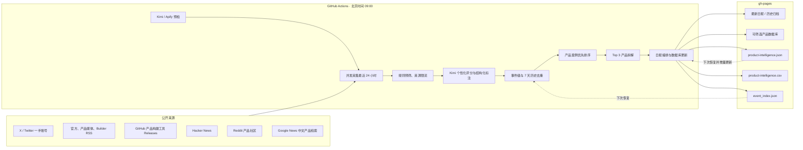

# AI 产品机会与 Builder 情报：PRD 与完整工作流

> 文档状态：v2.0，对应实现 PR #4
>
> 适用仓库：`Hank-Hee/News-Notification`
>
> 主要读者：项目所有者、运营维护者、后续开发者
>
> 最后更新：2026-07-24

这不是一份代码逐行说明，而是一份可以用来判断产品是否跑偏的产品与业务文档。它先说明产品服务谁、为什么存在、什么内容值得进入日报，再解释一条公开信息从被发现到进入日报和数据库的完整过程。

具体的 GitHub Secret、Variable、Actions 和 Pages 操作，请配合阅读 [部署与密钥配置 SOP](personal-ai-daily-setup.md)。

---

# 第一部分：PRD

## 1. 产品定义

### 1.1 产品名称

AI 产品机会与 Builder 情报。

### 1.2 一句话定位

每天自动收集全球最近 24 小时的一手 AI 产品和 Builder 信息，把新闻流转化为可拆解的产品案例、可复用的工作流、市场验证信号和 AI 产品经理技能线索。

### 1.3 产品形态

产品由三个前台产物和一个后台流程组成：

1. **每日中文情报页**：每天 8–12 条，Top 3 做完整产品拆解。
2. **结构化产品数据库**：持续积累产品、用户问题、工作流、技术栈、验证信号和 MVP 路径。
3. **历史日报归档**：按日期回看当时出现的产品与人物信号。
4. **GitHub Actions 自动流程**：每天北京时间 09:00 抓取、筛选、调用 Kimi、更新数据库并发布。

本地电脑不需要保持开机。

## 2. 核心用户画像

这套产品不是面向泛 AI 技术读者，而是为一个明确的个人目标定制：

- 当前角色是市场研究员；
- 正在建设 AI 相关知识平台和数据库；
- 希望寻找未来职业方向并转型 AI 产品经理；
- 需要产品灵感，也希望做出自己的产品；
- 关心别人如何发现问题、设计工作流、选择模型和工具、验证市场；
- 希望能把一个已出现的 AI 产品拆成自己可学习、可复刻的路径；
- 对医疗、医药、中医等垂直 AI 产品同样感兴趣。

因此，本产品回答的不是“今天 AI 圈发生了什么”，而是以下问题：

1. 今天出现了哪些值得拆解的新 AI 产品？
2. 它解决谁的什么问题？
3. 原来的工作流和使用产品后的工作流有什么变化？
4. 创建者用了什么模型、工具、数据、渠道或技能？
5. 产品已经发布、只有 Demo，还是仍然只是想法？
6. 用户和市场有什么真实反应？
7. 哪些做法可以迁移到自己的产品？
8. 如果自己做，最小 MVP 可以怎样开始？
9. 为转型 AI 产品经理，今天暴露了哪些技能缺口？

## 3. 产品要解决的问题

传统 AI 新闻聚合常见四类偏差：

- **论文偏差**：把新论文、基准分数和技术术语当成最重要的信息；
- **基础设施偏差**：GPU、推理框架和算力新闻占据大量篇幅；
- **媒体偏差**：只收录媒体成稿，错过 X 上创建者和关键人物的一手短消息；
- **摘要偏差**：虽然翻译成中文，但没有解释用户、场景、产品路径和市场证据，读完仍不知道能拿来做什么。

本产品的核心任务是把“信息密度”转化为“产品决策价值”。

## 4. 兴趣优先级与评分权重

所有候选信息都按下面的个人兴趣模型评估：

| 优先级 | 类型 | 权重 | 判断重点 |
|---|---|---:|---|
| 1 | AI 产品、真实案例和实现路径 | 30% | 是否做出了产品、解决了具体问题、跑通了工作流 |
| 2 | Builder、产品经理、工程师和关键人物方法 | 25% | 是否是一手分享，能否迁移到自己的产品实践 |
| 3 | 可以催生产品的新模型能力 | 15% | 不是看榜单，而是看它能解锁什么新体验 |
| 4 | 市场反馈、增长、商业化和失败教训 | 15% | 是否有用户、客户、收入、留存、评论或失败证据 |
| 5 | 融资、平台政策、竞争与监管 | 10% | 是否改变产品机会、获客渠道、成本或竞争格局 |
| 6 | 早期 Demo、弱信号和反常识思路 | 5% | 是否值得提前观察，但必须明确证据仍早期 |

### 明确降权的内容

- 单纯 GPU、算力、机密计算和推理基准；
- 没有产品映射的底层性能优化；
- 只有论文结论、没有真实应用路径的学术内容；
- 标题党、旧闻重发、模糊预告和纯营销；
- 没有用户、工作流、Demo 或证据的“成功”宣称。

这些内容只有在明确解锁新产品体验、显著降低产品成本或改变商业路径时，才可能进入日报。

## 5. 日报信息架构

### 5.1 今日最值得拆解的 3 个 AI 产品

Top 3 是日报最重要的部分。每条尽量回答：

- 产品和团队是谁；
- 目标用户是谁；
- 用户原来的问题是什么；
- 原工作流和新工作流分别是什么；
- 输入、处理、输出是什么；
- 使用了哪些模型、工具、数据和渠道；
- 当前处于 Demo、早期增长还是已有市场验证；
- 用户或市场有什么真实反应；
- 商业模式和获客方式是什么；
- 哪些方法可以迁移；
- 一个人怎样设计最小 MVP；
- 需要补哪些技能；
- 下一步还要验证什么。

输入没有说明的内容必须写“未公开”，不能用常识补齐。

### 5.2 Builder 与关键人物的一手方法

这一栏优先收录全球 AI 产品经理、工程师、创始人和关键人物直接分享的产品方法、工作流、踩坑经验和新方向。

关键人物的一句新模型预告可以收录，但优先级低于已经做出产品并分享路径的 Builder 内容。

### 5.3 新模型能力可以做成什么产品

这一栏不复述榜单或参数，而是解释新能力对应的产品机会。例如：

- 能否替代一个原本依赖人工的步骤；
- 能否让过去无法实时完成的任务变得可用；
- 能否形成新的交互方式、数据产品或垂直服务；
- 做成产品还缺什么可靠性、成本或渠道条件。

### 5.4 市场验证、商业化与失败案例

收录用户反馈、客户案例、增长、收入、融资、定价、获客、留存、竞争、监管以及失败复盘。负面案例同样重要，因为它能说明需求、体验或商业模式为什么没有成立。

### 5.5 AI 产品经理职业与技能雷达

系统从当日产品案例中聚合技能线索，例如用户研究、工作流设计、原型验证、Agent 设计、数据结构、评估、增长或行业知识，并给出当天可以执行的最小验证动作。

## 6. 产品目标

- 每天北京时间 09:00 自动运行一次；
- 处理最近 24 小时的全球公开信息；
- 正常情况下输出 8–12 条，质量不足时允许更少；
- Top 3 做完整产品拆解；
- 同一事件在单日只保留一个主条目；
- 最近 7 天重复事件不再推送，除非出现实质新进展；
- 每个产品记录可以进入长期数据库；
- 所有重要判断都能回到原始来源；
- Secret 不进入代码、日志、网页或 Git 历史；
- 认证、额度、模型参数和全部来源失败时明确报错，不发布误导性空日报。

## 7. 非目标

- 不追求覆盖所有 AI 新闻；
- 不为了凑数量加入低质量内容；
- 不做投资建议或法律判断；
- 不要求 Kimi 进行深度推理，默认关闭 Thinking；
- 不抓取需要绕过登录、权限或付费墙的私人信息；
- 当前公开 Pages 只保存公开来源，不保存个人笔记和私有研究；
- 不保证 GitHub cron 精确到 09:00 整启动，可能存在平台排队延迟。

## 8. 验收标准

### 内容验收

- 页面重点是产品、Builder、工作流和市场验证，不再被 GPU/论文主导；
- Top 3 能读懂“产品是什么、为什么有用、如何做、如何验证”；
- 关键事实不足时明确写“未公开”；
- X 一手短消息与正式发布被清楚区分；
- 每条都保留可点击原始来源；
- 数据库页面可搜索并按类型、阶段、地区和垂直方向筛选。

### 工程验收

- `MOONSHOT_API_KEY` 与 `APIFY_TOKEN` 缺失或无效时在正式运行前失败；
- `KIMI_BASE_URL=https://api.moonshot.cn/v1`；
- `KIMI_MODEL_ID=kimi-k2.6`；
- Kimi 请求使用 JSON 输出、`max_completion_tokens` 和 `thinking.type=disabled`；
- 关闭 Thinking 不兼容时明确失败，不静默切换到思考模式；
- 产品数据库在多次运行之间稳定去重和更新；
- 全量自动化测试通过；
- Actions 日志显示抓取、预筛、入选、AI 请求和 Token 用量。

---

# 第二部分：系统架构

## 9. 总体数据流

## 10. 当前信源策略

### X / Twitter

通过 Apify `altimis/scweet` Actor 监控约 65 个账号，包括：

- OpenAI、Anthropic、Google DeepMind、Meta AI、Microsoft AI 等官方账号；
- Sam Altman、Greg Brockman、Kevin Weil、Demis Hassabis 等关键人物；
- Cursor、Windsurf、Replit、Lovable、Vercel、Hugging Face 等产品与 Builder；
- LangChain、LlamaIndex、Dify、n8n、CrewAI、Browser Use 等工作流工具；
- 独立 Builder、产品作者和 AI 研究/教育者；
- Hippocratic AI、Abridge、Nabla、Ambience Health、OpenEvidence 等医疗 AI 产品。

采集范围被限制为最近 24 小时并排除转推。Actor 单次最多取回 100 条，进入 Horizon 后按互动和时效保留最多 30 条；每次运行另设 0.40 美元硬性费用上限。回复二次抓取目前关闭，避免一次日报额外启动多个付费 Actor；市场反应优先从原帖互动、媒体和其他公开来源交叉判断。

### RSS

RSS 分为四类：

- 官方产品更新：OpenAI、Google、DeepMind 等；
- 构建工具：GitHub AI、Microsoft Foundry、Hugging Face；
- 产品媒体：Product Hunt、TechCrunch AI、VentureBeat AI、The Verge AI；
- Builder 与产品方法：Simon Willison、One Useful Thing、Latent Space、Lenny's Newsletter。

失效订阅源不会保留。没有稳定 RSS 的官方机构由其官方 X 账号补充。

### 其他公开来源

- GitHub：只追踪更接近产品构建的 Agent、AI SDK、工作流和自动化工具 Release；
- Hacker News：发现 Show HN、新产品和工程师讨论；
- Reddit：配置保留但当前关闭，因为 GitHub runner 上连续出现 403/429，内容也不够稳定；
- Google News：补充中国 AI 产品、创业、医疗、医药和中医相关信息。

ArXiv、OSS Insight 和泛 GDELT 当前关闭，因为它们容易带来论文、基础设施和重复媒体噪声。

## 11. 核心数据对象

每条候选统一为 `ContentItem`，包括标题、URL、正文、作者、时间、来源和互动指标。Kimi 分析后增加：

- 0–10 分和评分理由；
- `product_case`、`builder_insight`、`model_capability`、`market_signal`、`business_policy` 或 `early_signal`；
- 来源等级、地区、事件键、证据状态和产品阶段；
- 产品名、Builder、目标用户、产品信号、市场信号；
- 技能线索、垂直方向和后续观察点。

Top 3 再增加用户问题、前后工作流、输入/处理/输出、工具栈、商业模式、市场反应、可迁移方法、MVP 路径和技能缺口。

---

# 第三部分：完整工作流

## 12. 步骤 0：触发

工作流有两种触发方式：

1. cron `0 1 * * *`，即每天 UTC 01:00、北京时间 09:00；
2. 在 GitHub Actions 页面手动点击 **Run workflow**。

手动运行适用于首次部署、更新 Secret、修改提示词或来源、失败后复查，以及准备合并新版本前的真实验证。

## 13. 步骤 1：准备运行环境

Actions 拉取目标分支，安装 Python 3.12 和 uv，再安装锁定依赖。所用 Actions 已升级到 Node.js 24 兼容版本：

- `actions/checkout@v6`；
- `actions/setup-python@v7`；
- `astral-sh/setup-uv@v9.0.0`。

这解决了旧 Action 基于 Node.js 20 的弃用警告。

## 14. 步骤 2：预检 Secret、API 地址和模型

### Kimi 预检

工作流先确认 `MOONSHOT_API_KEY` 非空，再访问 `${KIMI_BASE_URL}/models`：

- HTTP 不是 200：立即失败；
- Key 无权使用 `kimi-k2.6`：立即失败；
- Variable 配错模型：立即失败；
- 成功后日志显示 `Kimi API preflight passed`。

因此，Kimi 没有消费记录时，第一步应看预检和后续 AI 请求数，而不是直接假设“今天没有新闻”。

### Apify 预检

工作流确认 `APIFY_TOKEN` 非空，调用 Apify 用户接口验证 Token，并确认 `altimis/scweet` Actor 可见。Actor 第一次使用还必须在 Apify Console 人工批准权限；这是 Apify 的安全要求，无法通过 API 绕过。若未批准，抓取日志会输出 `full-permission-actor-not-approved` 和审批链接，不会把 403 误报成“今天没有推文”。

## 15. 步骤 3：恢复跨天状态

工作流从 `gh-pages` 恢复：

- `data/history/event_index.json`：最近 7 天事件记忆；
- `data/product-intelligence.json`：已有产品数据库；
- `data/product-intelligence.csv`：便于下载的平面表。

这些文件放在发布分支而不是 `main`，因为它们是运行产物，不应该每天制造主代码分支提交。

## 16. 步骤 4：并发采集

所有启用来源并发运行。单个来源失败会写入日志，但其他来源继续；如果全部来源失败，任务终止，不发布空日报。

每条内容必须在最近 24 小时窗口内。X 的日期范围同时下推给 Apify，避免先付费抓取大量旧内容再在本地丢弃。

## 17. 步骤 5：确定性预筛

调用 Kimi 前按顺序检查：

1. 是否有标题和 URL；
2. 是否在 24 小时窗口；
3. 标题和正文是否达到最低信息量；
4. 是否与 AI 产品、Agent、模型或自动化相关；
5. HN（以及以后重新启用的 Reddit）是否达到最低互动；
6. 规范化 URL 是否重复；
7. 规范化标题是否重复；
8. 单一子来源是否超过 15 条；
9. 总候选是否超过 60 条。

来源优先顺序是 X、RSS、GitHub、Hacker News、Reddit、Google News；当前 Reddit 关闭。X 的限流按账号计算，不会让约 65 个账号被当成同一个来源只留下 15 条。

日志中的 `Prefilter statistics` 会显示每种淘汰原因，方便判断是来源、规则还是模型阶段出了问题。

## 18. 步骤 6：跨来源合并

不同来源可能指向同一 URL。系统去除常见追踪参数并合并相同链接，保留正文更完整的条目，同时记录补充来源。

## 19. 步骤 7：Kimi 个性化评分与结构化标注

候选以每批最多 5 条发送给 `kimi-k2.6`。模型只做评分、分类、事件判断、中文摘要和字段抽取，不需要深度推理。5 条批次是在真实运行中根据结构化输出稳定性和总耗时收紧后的值。

调用约束：

- `extra_body={"thinking":{"type":"disabled"}}`；
- `response_format={"type":"json_object"}`；
- 使用 `max_completion_tokens`；
- 不发送已弃用的 Provider 参数 `max_tokens`；
- 模型输出经过 Pydantic 结构校验；
- 批次中的 ID 必须与输入一一对应。

如果 SDK 或模型不接受 `extra_body`，系统记录明确错误并停止，不能删掉参数后静默进入思考模式。

评分阈值当前为 7.0。大批次结构无法解析时会递归拆小；单条仍无法解析时保守记为 0 分。若所有候选都没有有效 AI 结果，任务失败，不发布“今日平静”的假象。

## 20. 步骤 8：事件级与七天历史去重

去重分四层：

1. URL 去重；
2. 标题去重；
3. Kimi 判断同一现实事件的多来源报道；
4. 最近 7 天历史事件去重。

同一产品出现正式发布、重大功能、定价、关键指标、客户、融资或合作等实质增量时允许再次进入日报。

## 21. 步骤 9：最终数量与产品优先排序

系统最多保留 12 条，只从 7.0 分以上候选中选择，不再执行旧版“技术/产品、中国/海外 50:50”的软平衡。

排序首先确保尽可能有 3 个 `product_case` 进入 Top 3；不足时按 Builder 方法、可产品化模型能力和其他高分信号补齐。剩余条目仍按兴趣类型和分数组织。

## 22. 步骤 10：X 回复扩展（当前关闭）

系统保留为高分 X 条目抓取回复并重新分析的能力，但生产配置当前设为 `fetch_reply_text=false`。待主流程稳定并确认每日成本后，可再小范围开启，最多扩展 3 条推文。

这一步不是把评论当事实，而是帮助判断：

- 用户是否真的理解或想使用；
- 主要质疑点是什么；
- 是否存在实际采用、失败或需求信号。

## 23. 步骤 11：Top 3 产品深度拆解

Top 3 先抽取需要核验的产品、团队、工作流或指标，再进行有限背景搜索，最后让 Kimi 输出产品拆解结构。

搜索结果只用于补充背景，不能覆盖官方原始事实；引用链接必须来自输入原文或真实搜索结果。增强失败时保留第一轮摘要，不影响其他条目发布。

## 24. 步骤 12：生成日报

程序化渲染固定的五个模块，避免让模型自由决定页面结构。模型提供的是经过校验的数据，页面负责把它组织成普通人能读懂的中文。

页面同时显示当天 3–5 条“今天先看什么”信号、筛选数量、更新时间、原始来源、证据状态和产品阶段。

## 25. 步骤 13：更新结构化产品数据库

只有能识别为产品案例，或明确关联产品的 Builder/市场信号，才进入产品数据库。

### 稳定去重

数据库根据规范化的产品名与 Builder 生成稳定 `product_id`。同一产品下一次出现时更新 `last_seen`、当前字段、来源和时间线，不重复创建新产品。相同事件重跑不会重复增加 occurrence 或 update。

### 主要字段

- 产品名、Builder、首次和最近发现日期；
- 情报类型、产品阶段、证据状态和地区；
- 目标用户和用户问题；
- 原工作流、新工作流和输入/处理/输出；
- 模型、工具、数据和渠道；
- 市场信号、商业模式和市场反应；
- 可迁移方法、MVP 路径和技能线索；
- 原始来源与产品更新历史。

### 产出形式与查看方式

数据库随 Pages 发布到：

- `/data/product-intelligence.json`：保留嵌套结构，适合程序、分析和以后迁移；
- `/data/product-intelligence.csv`：适合 Excel、Numbers 或数据库导入；
- `/products/`：网页中搜索，并按类型、阶段、地区和垂直方向筛选。

## 26. 步骤 14：发布 GitHub Pages

日报保存为 `docs/_posts/YYYY-MM-DD-summary-zh.md`，数据库写入 `docs/data/`，然后 `peaceiris/actions-gh-pages` 部署整个 `docs` 目录到 `gh-pages`。

`keep_files: true` 会保留历史日报。首页显示最新中文日报，历史日报仍可按日期打开。

## 27. 步骤 15：记录用量与结果

成功日志显示：

- 各来源抓取数量；
- 预筛淘汰和保留数量；
- 通过阈值和去重后的数量；
- 深度拆解数量；
- AI 请求总数和各阶段请求数；
- 输入、输出和总 Token；
- 产品数据库更新数量。

这些数据用来判断成本异常。例如候选长期顶到 60、输出 Token 明显增长或 Apify 每日运行次数异常时，应先收紧来源和批次，而不是直接降低内容质量。

---

# 第四部分：安全、隐私与可信度

## 28. Secret 与 Variable

### Repository Secrets

- `MOONSHOT_API_KEY`：Kimi Platform API Key；
- `APIFY_TOKEN`：Apify API Token。

### Repository Variables

- `KIMI_BASE_URL=https://api.moonshot.cn/v1`；
- `KIMI_MODEL_ID=kimi-k2.6`。

Secret 只在 Actions 进程运行时注入环境变量。代码、配置、网页和数据库都不保存明文。

## 29. 当前 Pages 是否公开

是。仓库和 GitHub Pages 当前是公开的，所以日报、JSON、CSV 和 `/products/` 页面都可被知道链接的人访问，也可能被搜索引擎发现。没有把链接发给别人不等于私有。

当前只写入公开来源，因此可以先这样运行。如果以后要加入个人笔记、求职研究、客户信息或私有判断，应改用以下方案之一：

1. 私有仓库的 Actions Artifact，仅登录 GitHub 后下载；
2. 带身份认证的私有站点；
3. 私有数据库或 Notion，只把公开摘要发布到 Pages。

## 30. 可信度边界

- 一手来源优先，但一手来源仍可能带有营销倾向；
- 媒体报道标记为 `reported`，不能写成已经官方确认；
- X 预告标记为 `early_signal`，不能写成已经发布；
- 没有数据的市场反应写“未公开”；
- 搜索摘要不能成为新事实的唯一依据；
- 日报是产品研究入口，不是最终尽调报告。

---

# 第五部分：异常诊断与运营

## 31. 为什么不再笼统显示“今日暂无重要动态”

旧文案把来源平静、阈值过高和模型异常混在一起，容易掩盖实际故障。新版空日报要求按日志判断：

1. `Fetched` 是否大于 0；
2. `Prefilter statistics.kept` 是否大于 0；
3. `Analyzed` 和 Kimi 请求数是否大于 0；
4. `items scored` 是否大于 0。

Kimi 配置错误、Apify Token 错误、全部来源失败或全部 AI 解析失败都会让工作流失败，不会发布“今天比较平静”。

## 32. 常见错误矩阵

| 现象 | 最可能原因 | 处理 |
|---|---|---|
| Missing `MOONSHOT_API_KEY` | Secret 名称错或不在 Repository | 覆盖创建同名 Secret 后重跑 |
| Kimi `/models` 401 | Key 无效、过期或来自错误平台 | 在 Kimi Platform 新建 Key 并覆盖 Secret |
| 模型不可用 | Variable 不是 `kimi-k2.6` 或 Key 无权限 | 修正 Variable，确认模型权限 |
| Thinking disablement incompatible | SDK/模型不接受关闭 Thinking | 查看明确错误，升级兼容版本；不要删参数 |
| Missing/invalid `APIFY_TOKEN` | Secret 未设置或 Token 无效 | 在 Apify 创建 Token，覆盖 Secret 后重跑 |
| `full-permission-actor-not-approved` / 403 | Token 有效，但 Actor 权限尚未人工批准 | 打开日志给出的 Apify Console 链接，审核并批准后重跑 |
| Twitter 抓取 0 条 | 最近 24 小时账号平静、Actor 返回为空或账号名失效 | 看 Apify run 与来源统计，更新账号列表 |
| 单一 RSS 失败 | Feed 改址或临时不可用 | 验证 URL；其他来源仍会继续 |
| 全部来源失败 | 网络或配置系统性故障 | 任务会失败，修复后重跑 |
| 候选很多但入选少 | 产品相关性不足或阈值较高 | 先看评分分布，再调整来源/提示词，最后才动阈值 |
| 数据库页面 404 | 尚未成功运行新版工作流 | 成功运行并部署一次后刷新 Pages |

修改 Secret、Variable、提示词、来源或代码后，需要手动重跑一次，旧的运行不会自动使用新值。

## 33. 每日检查清单

1. Actions 中当天运行是否成功；
2. Kimi 与 Apify 预检是否通过；
3. X、RSS、GitHub、社区和中文来源是否有合理抓取量；
4. 候选是否长期顶到 60；
5. 入选是否以产品案例、Builder 方法和市场信号为主；
6. Top 3 是否真正回答用户、工作流、验证和 MVP；
7. 页面中是否出现把“未公开”强行补成事实的内容；
8. `/products/` 是否能看到最新记录；
9. Kimi Token 和 Apify run 次数是否异常增长。

## 34. 推荐调参顺序

如果内容不符合兴趣，不要先降低阈值。推荐顺序：

1. 删除持续产生噪声的来源；
2. 增加更接近目标的产品和 Builder 一手账号；
3. 调整个性化评分提示词；
4. 调整来源优先顺序和单来源上限；
5. 最后才微调 `ai_score_threshold`。

如果成本过高，推荐顺序：

1. 降低 X `fetch_limit`；
2. 降低总 `candidate_limit`；
3. 减少回复扩展条数；
4. 减少 RSS 或社区来源；
5. 不要通过允许模糊输出或开启 Thinking 来换取表面成功。

---

# 第六部分：设计决策

## 35. 为什么优先 X，而不是只看媒体

产品创建者常在媒体成稿前先发布 Demo、工作流、产品思考或新模型预告。X 能提供更早的一手信号；RSS 和媒体则负责补充事实、商业信息和后续验证，两者互补。

## 36. 为什么数据库放在 `gh-pages`

它是每日运行产物，和历史日报一样会持续变化。放在 `main` 会制造大量自动提交和 PR 冲突；放在 `gh-pages` 可以在每次运行中恢复、更新并重新发布。

## 37. 为什么同时保留 JSON、CSV 和网页

- JSON 保留最完整结构，适合后续程序和数据库迁移；
- CSV 适合人工分析和表格工具；
- 网页让日常查看不依赖下载或写代码。

三种形式来自同一份数据，避免维护三套数据库。

## 38. 为什么 Top 3 才做深度拆解

所有 8–12 条都做第二轮搜索会显著增加 Kimi Token、搜索时间和失败概率。Top 3 覆盖当天最重要的产品案例，其余条目保留产品启发和验证点，能在成本和信息深度之间取得更合理的平衡。

## 39. 为什么 Thinking 必须失败关闭

这套任务是结构化抽取和编辑，不需要深度推理。若 SDK 不支持关闭 Thinking 后自动删除参数，可能无声增加延迟、输出 Token 和费用。明确失败更容易诊断，也能保证成本策略真实生效。

---

# 第七部分：后续路线图

## 40. 短期

- 根据一周实际结果淘汰持续失效或低价值的 X 账号和 RSS；
- 为产品数据库增加收藏、手工备注和“准备拆解”状态；
- 建立日报人工反馈字段：有用、无用、已读、想复刻；
- 用实际点击和收藏反向校准兴趣权重。

## 41. 中期

- 把数据库迁移到私有存储，并保留公开版摘要；
- 增加产品、Builder、公司、垂直行业之间的关联；
- 自动生成“本周最值得复刻的产品”和“职业技能进展”；
- 为医疗、医药和中医建立更专业的垂直来源与合规字段。

## 42. 暂不实施

- 自动发布到社交媒体；
- 未经人工确认的投资建议；
- 对私人群聊、付费内容或客户材料进行抓取；
- 让模型代替真实用户访谈和产品验证。

---

# 附录：一条信息的完整旅程

以某位 Builder 在 X 上发布一个已跑通的 AI 市场研究产品为例：

1. 09:00 工作流启动并通过 Kimi/Apify 预检；
2. Apify 只抓取最近 24 小时账号内容，排除转推；
3. 预筛确认它与 AI 产品相关、没有重复，且该账号未超过来源上限；
4. Kimi 把它标记为 `product_case`，抽取产品、用户、工作流和市场信号；
5. 事件级与七天历史去重确认这是新事件；
6. 产品案例优先排序让它进入 Top 3；
7. 系统有限搜索产品与团队背景，缺失字段保留“未公开”；
8. 日报展示用户问题、前后工作流、工具栈、市场反应、MVP 和技能缺口；
9. 产品数据库按产品名与 Builder 生成稳定 ID；
10. JSON、CSV、数据库网页和当日日报一起部署到 `gh-pages`；
11. 下次产品出现定价或增长新进展时，更新同一个产品记录，而不是重复创建。

这就是整套系统的核心闭环：发现一手信号，判断产品价值，拆解可迁移路径，积累结构化知识，再用后续市场变化持续更新判断。

## 相关文档

- [部署与密钥配置 SOP](personal-ai-daily-setup.md)
- [GitHub Pages 首页](index.md)
- [产品情报数据库]({{ '/products/' | relative_url }})
