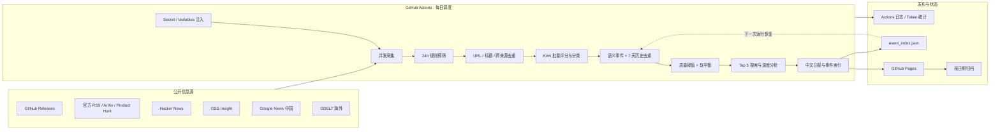
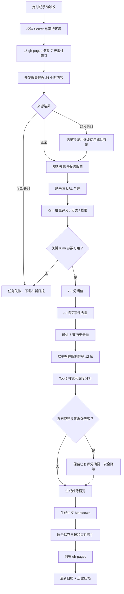

# Horizon AI Daily：产品需求与完整工作流讲解

> 文档状态：v1.0（与当前 `main` 实现一致）
>
> 适用仓库：`Hank-Hee/News-Notification`
>
> 主要读者：项目所有者、运营维护者、后续开发者
>
> 最后更新：2026-07-23

## 0. 如何阅读本文

本文分成两个视角：

1. **PRD 视角**：解释这个产品解决什么问题、服务谁、怎样才算成功。
2. **工作流视角**：解释一条新闻从被发现到出现在中文日报中的完整过程，以及每个步骤为什么存在。

本文不会逐行解释代码，但会把关键业务规则、数据流、失败处理、安全边界和日常维护方式讲清楚。具体密钥设置和 GitHub 页面操作可配合阅读 [部署与密钥配置 SOP](personal-ai-daily-setup.md)。

---

# 第一部分：PRD（产品需求文档）

## 1. 产品概述

### 1.1 产品名称

Horizon AI Daily——个人中文 AI 前沿与产品研究简报。

### 1.2 一句话定位

每天自动收集最近 24 小时的公开 AI 信息，经过规则预筛、Kimi 评分、事件级去重和中文编辑，最终发布一份质量优先、可追溯、可归档的中文日报。

### 1.3 产品形态

这是一个运行在 GitHub 上的无人值守信息处理系统：

- GitHub Actions 负责每天定时启动；
- 多个公开来源提供候选新闻；
- Kimi 负责评分、分类、事件判断、摘要和文字组织；
- GitHub Pages 提供网页阅读和历史归档；
- GitHub Secret 保存 API Key；
- 本地电脑不需要持续开机。

## 2. 背景与问题

AI 新闻的主要问题不是“信息太少”，而是“信息太多但有效增量太少”。典型痛点包括：

- 同一事件被官方、媒体、社区和聚合站重复发布；
- 营销稿、标题党、旧闻重发和模糊预告占据注意力；
- 中国和海外、技术和产品信息容易失衡；
- 只看热度容易错过高价值但传播量不大的官方更新；
- 每天人工搜索、阅读、去重和总结成本很高；
- 普通聚合器缺少跨天记忆，连续多日重复推荐同一事件；
- 只生成链接列表，无法快速回答“发生了什么、为什么重要、下一步看什么”。

本产品的核心任务是把“公开信息流”转化为“可执行的个人研究简报”。

## 3. 目标用户

### 3.1 核心用户

关注 AI 技术和产品动态，但不希望每天花大量时间浏览几十个网站的个人用户，包括：

- AI 产品经理和创业者；
- 开发者、技术负责人和研究人员；
- 投资、咨询、战略或行业研究人员；
- 需要同时关注中国与海外 AI 进展的读者。

### 3.2 典型使用场景

1. 早晨用 10–15 分钟了解过去 24 小时最重要的 AI 增量。
2. 快速区分技术突破、产品发布、商业落地和普通宣传。
3. 找出值得进一步阅读原文或持续跟踪的事件。
4. 通过历史归档回顾某段时间的 AI 发展节奏。
5. 观察 GitHub 项目的增长、成熟度和采用价值。

## 4. 产品目标与非目标

### 4.1 产品目标

- 每天自动生成一份简体中文 AI 日报。
- 默认选出 10–12 条高质量内容；质量不足时允许少于 10 条。
- 覆盖技术与产品、中国与海外，并尽量保持阅读结构平衡。
- 同一现实事件只保留一个主条目，并附带有价值的补充来源。
- 最近 7 天已出现的事件不重复推荐，除非出现实质性新进展。
- Top 5 提供更完整的背景、影响、限制和后续观察点。
- 每条结论尽量回到真实来源，明确区分事实、观点和推断。
- 系统能够无人值守运行，并在失败时给出可诊断日志。
- API Key 不进入代码、日志、网页或 Git 历史。

### 4.2 明确的非目标

- 不追求覆盖所有 AI 新闻。
- 不为了凑够 10 条而加入低质量内容。
- 不进行投资建议、法律判断或事实调查式深度研究。
- 不让模型进行长链条深度推理；当前任务只需要评分、分类、去重、摘要和编辑。
- 不自动发布到社交媒体、邮件或聊天工具；当前版本只发布 GitHub Pages。
- 不抓取需要登录、付费墙或绕过访问限制的私人内容。
- 不保证 GitHub 定时任务在精确到分钟的时刻启动。

## 5. 产品原则

### 5.1 质量优先于数量

“10–12 条”是目标容量，不是硬性最低数量。只有达到评分阈值的条目才有资格入选。

### 5.2 规则先于模型

确定性规则能处理的任务，例如时间窗口、空标题、明显非 AI 内容、URL 重复和来源上限，应当在调用 Kimi 前完成，以节省 Token 并减少噪声。

### 5.3 第一手来源优先

同一事件有多个来源时，优先保留官方公告、项目 Release、官方文档和论文原文；其他来源作为补充材料。

### 5.4 平衡是软目标

技术/产品、中国/海外的比例用于改善阅读结构，但不会压过质量阈值。系统不会为了满足比例而加入不合格内容。

### 5.5 失败必须可见

认证、额度、模型参数或“无法确认关闭 Thinking”等关键错误必须让任务明确失败，不能生成看似正常但实际不可信的日报。

### 5.6 可追溯而非黑箱

日报保留原始链接、评分理由、来源等级、时间、限制与观察点，便于用户回到证据本身。

## 6. 核心用户故事

| 编号 | 用户故事 | 验收结果 |
|---|---|---|
| US-01 | 作为读者，我希望每天看到最近 24 小时最重要的 AI 信息 | 每天生成带日期的中文日报 |
| US-02 | 作为忙碌的专业用户，我希望快速知道为什么一条新闻重要 | 每条内容包含摘要、评分和重要性说明 |
| US-03 | 作为技术与产品的综合关注者，我不希望日报只偏向某一种内容 | 系统采用技术/产品软平衡 |
| US-04 | 作为同时关注中外市场的用户，我希望看到中国和海外进展 | 系统采用中国/海外软平衡 |
| US-05 | 作为长期读者，我不希望连续几天看到同一件事 | 运行内去重加最近 7 天历史去重 |
| US-06 | 作为研究者，我希望重要新闻有更多背景和不确定性说明 | Top 5 执行有边界的搜索与深度分析 |
| US-07 | 作为仓库所有者，我希望 API Key 安全且系统可维护 | Key 只从 Secret 注入，日志进行脱敏 |
| US-08 | 作为维护者，我希望失败时能知道发生在哪一步 | Actions 日志显示步骤、错误和用量 |

## 7. 功能需求

| 编号 | 功能 | 需求说明 |
|---|---|---|
| FR-01 | 自动触发 | 每天北京时间约 07:30 自动运行，也支持手动运行 |
| FR-02 | 多源采集 | 并发采集 GitHub、RSS、Hacker News、OSS Insight、GDELT 和 Google News |
| FR-03 | 规则预筛 | 仅保留最近 24 小时、具备基本信息、AI 相关且满足最低质量条件的候选 |
| FR-04 | 候选限流 | 单一子来源最多保留 15 条，总候选最多 80 条 |
| FR-05 | AI 评分 | Kimi 按统一权重给出 0–10 分、理由和中文摘要 |
| FR-06 | 分类标注 | 每条标注技术/产品、中国/海外、来源等级、事件键和是否为实质更新 |
| FR-07 | 多层去重 | 处理 URL、标题、跨来源、语义事件和跨天历史重复 |
| FR-08 | 质量阈值 | 默认只保留评分不低于 7.5 的条目 |
| FR-09 | 内容平衡 | 在合格条目中尽量实现技术/产品和中国/海外各约 50% |
| FR-10 | 数量控制 | 最多输出 12 条；不足时不使用低分内容补齐 |
| FR-11 | 深度分析 | 仅对排名最高的 5 条进行背景搜索和第二轮分析 |
| FR-12 | 趋势总结 | 根据最终入选条目生成 3–5 条今日趋势 |
| FR-13 | 中文编排 | 生成包含 Top 5、技术、产品、GitHub、继续关注和方法说明的中文 Markdown |
| FR-14 | 历史记忆 | 保存事件索引，并在下一次运行前从 `gh-pages` 恢复 |
| FR-15 | 网页发布 | 将日报发布到 GitHub Pages，并保留按日期归档 |
| FR-16 | 可观测性 | 输出候选统计、入选统计、请求次数和 Token 用量 |
| FR-17 | 安全失败 | Kimi 关键参数不兼容、认证或额度错误时停止发布 |

## 8. 非功能需求

| 类别 | 要求 |
|---|---|
| 安全性 | API Key 只存在于 GitHub Secret 和进程环境变量中；日志脱敏 |
| 可靠性 | 单个新闻源失败不应拖垮整次任务；全部来源失败必须终止 |
| 一致性 | AI 输出使用 JSON Mode，并经过结构校验和 ID 映射校验 |
| 成本控制 | 先规则过滤、再批量评分；只对 Top 5 做深度处理 |
| 可维护性 | 主要业务参数集中在 `data/config.github.json` |
| 可恢复性 | 历史索引随 Pages 发布，下一次任务可以恢复 |
| 数据完整性 | 日报和历史索引采用原子写入，降低中途写坏文件的风险 |
| 可审计性 | 保留来源链接、评分理由、来源等级和执行日志 |
| 可移植性 | 依赖 GitHub Actions、公开数据源和 OpenAI-compatible API |

## 9. 成功指标与验收标准

### 9.1 产品指标

- 正常情况下每天产出 1 份中文日报。
- 最终条目不超过 12 条，且全部达到 7.5 分阈值。
- 同一现实事件在单日输出中只出现一次。
- 最近 7 天的旧事件不会重复出现，除非存在实质更新。
- Top 5 具备“发生了什么、为什么重要、关键细节、影响、限制、后续观察”字段。
- 每条新闻可以回到原始或补充来源。

### 9.2 工程验收标准

- GitHub Actions 能够从 `main` 手动和定时运行。
- `MOONSHOT_API_KEY` 缺失时在调用模型前失败。
- Kimi 请求使用 `kimi-k2.6`、关闭 Thinking、使用 JSON Mode 和 `max_completion_tokens`。
- 无法确认关闭 Thinking 时任务失败，不进行无控制重试。
- 日报成功写入 `docs/_posts/`，并部署到 `gh-pages`。
- 日志不包含真实 API Key。
- 自动化测试覆盖核心筛选、去重、平衡、Kimi 参数和页面生成逻辑。

## 10. 当前版本范围

### 10.1 已启用

- 简体中文单语言日报；
- GitHub Pages 网页与历史归档；
- 公开来源采集；
- Kimi 评分、分类、摘要、事件识别和编辑；
- Top 5 有边界的网络背景搜索；
- Token 和请求量统计；
- 七天事件历史。

### 10.2 已关闭或暂不使用

- Reddit、Twitter、Telegram；
- 邮件发送；
- Webhook 推送；
- 多语言日报；
- 付费或私有数据源；
- 自动事实核查和人工审核工作台。

---

# 第二部分：系统架构

## 11. 总体架构图

## 12. 核心组件及职责

| 组件 | 主要职责 | 不负责什么 |
|---|---|---|
| GitHub Actions | 调度、准备环境、运行程序、部署 Pages | 不判断新闻价值 |
| Scrapers | 从各公开来源取得统一格式的候选条目 | 不做最终评分 |
| Prefilter | 用确定性规则去掉明显噪声和重复 | 不做语义判断 |
| Kimi Analyzer | 评分、分类、来源分级、事件键、中文摘要 | 不直接决定页面样式 |
| Dedup Pipeline | 合并同 URL、同事件和跨天重复 | 不因题材相似就强行合并 |
| Balance Selector | 在合格内容中改善结构 | 不降低质量阈值 |
| Content Enricher | 为 Top 5 补充背景和深度说明 | 不对全部候选进行昂贵搜索 |
| Daily Summarizer | 把结构化结果编排成中文 Markdown | 不重新评判新闻真假 |
| Event History | 记录最近事件，支持跨天去重 | 不保存完整文章数据库 |
| GitHub Pages | 展示最新日报和历史归档 | 不保存 Secret |

## 13. 核心数据对象

每条候选新闻在内部被统一成一个 `ContentItem`，逻辑上包含：

- 稳定 ID；
- 来源类型；
- 原始标题、URL、正文或摘要；
- 作者、发布时间和抓取时间；
- 来源特有指标，例如分数、Star 增长或仓库名；
- Kimi 生成的评分、理由、中文摘要和标签；
- 分类、地区、来源等级、事件键、实质更新标记；
- Top 5 才具有的深度分析字段和可验证来源。

统一数据结构的价值是：不同来源进入后续流程时使用相同规则，不需要为每个来源重新设计一套评分和输出逻辑。

---

# 第三部分：完整工作流逐步讲解

## 14. 流程总览

## 15. 步骤 0：触发工作流

工作流有两种启动方式：

1. **自动启动**：cron 为 `30 23 * * *`，即 UTC 23:30，约等于北京时间次日 07:30。
2. **手动启动**：仓库所有者可在 Actions 页面选择 `main` 后点击 `Run workflow`。

为什么使用 07:30：

- 覆盖前一自然日和夜间发布的重要消息；
- 为抓取、AI 分析和 Pages 部署预留时间；
- 目标是在早间阅读时段前形成报告。

GitHub 的定时任务可能排队，因此 07:30 是目标触发时间，不是严格 SLA。

## 16. 步骤 1：准备运行环境

GitHub Actions 会依次：

1. 检出 `main` 代码；
2. 安装 Python 3.12；
3. 安装固定版本的 uv；
4. 根据锁文件安装依赖；
5. 把 Secret 和 Variables 注入当前进程。

关键环境变量：

| 变量 | 类型 | 作用 |
|---|---|---|
| `MOONSHOT_API_KEY` | Repository Secret | 调用 Kimi API，必须存在 |
| `KIMI_MODEL_ID` | Repository Variable | 模型 ID；为空时默认 `kimi-k2.6` |
| `KIMI_BASE_URL` | Repository Variable | Kimi OpenAI-compatible API 地址 |
| `GITHUB_TOKEN` | GitHub 自动生成 | 读取公开 GitHub 数据、获取历史分支、发布 Pages |

随后，工作流把 `data/config.github.json` 复制成运行时读取的 `data/config.json`。这样仓库可以保留面向 GitHub 的配置模板，同时复用 Horizon 原有的配置加载方式。

## 17. 步骤 2：恢复七天事件记忆

GitHub Actions 每次运行都是新的临时机器，本地磁盘不会自动保留上一次运行的文件。因此系统不能只把历史索引放在 runner 上。

当前方案是：

1. 上一次运行把 `event_index.json` 一起发布到 `gh-pages`；
2. 新任务启动时尝试获取 `gh-pages`；
3. 将历史索引恢复到 `data/history/event_index.json`；
4. 当天筛选完成后更新索引并再次发布。

这使 `gh-pages` 同时承担“网页发布分支”和“小型持久化状态载体”两个角色。

如果首次运行没有 `gh-pages`，恢复步骤会跳过并从空历史开始，不会因此失败。

## 18. 步骤 3：确定时间窗口

程序以当前 UTC 时间减去 24 小时，得到本次抓取的起点。手动运行使用 `--hours 24`，与配置中的 24 小时窗口保持一致。

时间窗口是第一道边界：一条新闻即使很重要，如果不属于最近 24 小时，也不会进入当天日报。跨天的重要新进展由“实质更新”逻辑处理，而不是放宽整个时间窗口。

## 19. 步骤 4：并发采集公开来源

### 19.1 当前来源组合

| 来源组 | 当前用途 |
|---|---|
| GitHub Releases | 监控 OpenAI、Anthropic、Transformers、vLLM、AutoGen、Semantic Kernel、Qwen、DeepSeek、GLM、Kimi 等项目 |
| 官方与专业 RSS | OpenAI、Google DeepMind、Google AI、Hugging Face、Product Hunt、ArXiv、Simon Willison |
| Hacker News | 补充开发者社区中高热度的重要讨论 |
| OSS Insight | 识别近期增长的 AI 开源项目 |
| Google News 中国 | 补充中国公司、模型、产品和商业动态 |
| GDELT 海外 | 补充全球公开媒体中的 AI 事件 |

### 19.2 为什么需要多种来源

- 官方来源可信度高，但不会覆盖行业评价和采用情况；
- 媒体覆盖面大，但可能重复或带有二次解释；
- 社区能反映真实采用和争议，但噪声较多；
- GitHub 与 OSS Insight 能发现产品新闻之外的开源趋势；
- 中国与海外使用不同入口，可以减少语言和地区偏差。

### 19.3 来源失败策略

所有抓取任务并发进行。单一来源报错时：

- 记录来源名和脱敏错误；
- 其他来源继续运行；
- 当天日报可以基于剩余来源生成。

只有当所有已尝试来源都失败时，系统才认为基础数据不可用并终止任务。这样可以在可靠性与信息完整性之间取得平衡。

## 20. 步骤 5：确定性规则预筛

这一步发生在任何 Kimi 请求之前，目的是减少噪声和成本。

### 20.1 逐条检查规则

系统依次检查：

1. 是否存在标题和 URL；
2. 发布时间是否在最近 24 小时；
3. 标题或正文是否具有最低信息量；
4. 标题、正文和元数据中是否有明确 AI 相关词；
5. Hacker News 等社区来源是否达到最低互动门槛；
6. 清理 URL 中常见的 UTM、广告和跟踪参数；
7. 是否与已保留条目具有相同规范化 URL；
8. 是否与已保留条目具有相同规范化标题；
9. 是否超过单一子来源 15 条的上限；
10. 是否超过总候选 80 条的上限。

### 20.2 重复条目的保留原则

如果相同 URL 或标题出现多次，系统优先保留正文信息更丰富的一条，而不是简单保留第一条。

### 20.3 为什么要限制来源数量

当某个来源当天内容特别多时，它可能占满全部候选，使 Kimi 的评分空间被单一来源垄断。单来源上限用于保持候选池多样性，也能控制 Token 成本。

### 20.4 可观测结果

日志会输出预筛统计，例如：

- 超出时间窗口多少条；
- 非 AI 内容多少条；
- URL 和标题重复多少条；
- 因来源上限或候选上限删除多少条；
- 最终保留多少候选。

## 21. 步骤 6：跨来源 URL 合并

规则预筛主要处理同一批次中的明显 URL/标题重复；随后系统还会按规范化 URL 再次分组，处理不同抓取器带来的跨来源重复。

当多个来源指向同一个页面时：

- 选择正文最丰富的条目作为主条目；
- 合并其他条目的元数据；
- 在需要时拼接有价值的补充正文；
- 记录该条目来自哪些来源。

这一步不调用 AI，因此速度快且结果稳定。

## 22. 步骤 7：Kimi 批量评分与结构化标注

### 22.1 为什么批量处理

候选默认每 10 条组成一个批次，最多并发 2 个分析请求。批量处理可以减少 API 请求数量和重复提示词 Token，同时通过稳定 ID 把结果映射回原条目。

### 22.2 评分权重

Kimi 按以下权重综合评分：

| 维度 | 权重 |
|---|---:|
| 新颖性与时效性 | 20% |
| 来源可信度 | 20% |
| 技术或产品影响 | 20% |
| 实际应用与商业价值 | 15% |
| 对目标读者的相关性 | 15% |
| 证据完整性与可验证性 | 10% |

分数含义：

- 9–10：当天必读；
- 8–8.9：高价值；
- 7–7.9：有明确增量；
- 5–6.9：通常不收录；
- 0–4.9：噪声、旧闻、营销或低相关内容。

### 22.3 每条返回的业务字段

Kimi 不只返回一个分数，还需要给出：

- `category`：技术或产品；
- `region`：中国或海外；
- `source_tier`：Tier 1–5；
- 是否第一手来源；
- 是否新事件；
- 是否存在实质性更新；
- 是否偏营销；
- 稳定的 `event_key`；
- 评分理由；
- 简体中文一句话摘要；
- 标签和后续观察点；
- GitHub 项目的阶段、用途、价值、风险和建议。

### 22.4 来源等级

- Tier 1：公司、实验室或项目官方公告；
- Tier 2：GitHub Release、官方文档、论文原文；
- Tier 3：权威科技或行业媒体；
- Tier 4：知名开发者、研究者或分析师；
- Tier 5：社区、聚合与转载。

来源等级会影响评分，也会影响语义去重时主条目的选择。

### 22.5 Kimi 请求约束

当前调用具备四个关键约束：

1. 模型默认是 `kimi-k2.6`；
2. 通过 `extra_body` 明确发送 `thinking.type=disabled`；
3. 使用 `response_format={"type":"json_object"}`；
4. 使用 `max_completion_tokens=8192`，不使用已弃用的 `max_tokens`。

为什么关闭 Thinking：当前任务是信息分类、评分、去重、摘要和编辑，不需要长链条推理。关闭 Thinking 可以降低不必要的延迟和输出开销，并让结构化结果更直接。

### 22.6 安全失败策略

如果 SDK 或模型拒绝 Thinking 控制：

- 系统记录清晰错误；
- 不删除 `extra_body` 后重试；
- 不静默切换到思考模式；
- 将错误视为致命错误并终止任务。

对于 `kimi-k2.6`，JSON Mode 或 `max_completion_tokens` 被拒绝时也采用相同的“失败关闭”原则。

### 22.7 JSON 校验与批次降级

模型返回后，系统会检查：

- 是否为可解析 JSON；
- 是否存在 `items` 数组；
- 每个 ID 是否来自输入；
- 是否有漏项、重复 ID 或错误 ID；
- 分数、分类、地区等字段是否符合规定类型和范围。

如果一个大批次无法正确解析，系统会把批次递归拆小，最终尝试逐条分析。单条仍然失败时，该条使用保守默认值并得到 0 分，因此不会越过 7.5 分阈值进入日报。

认证、额度和关键模型参数错误不会走这种内容级降级，而是直接终止整次任务。

## 23. 步骤 8：质量阈值

分析完成后，只保留 `ai_score >= 7.5` 的条目，并按分数从高到低排序。

这一顺序很重要：后续去重、平衡和深度分析都只作用于已达到质量标准的条目，避免在低质量数据上继续消耗资源。

## 24. 步骤 9：AI 语义事件去重

有些重复事件不会共享相同 URL 或标题。例如：

- 官方发布公告；
- 媒体对同一公告的报道；
- 社区对同一公告的讨论；
- 标题不同但事实完全相同的转载。

系统把已经评分的标题、标签、摘要、来源等级和第一手标记交给 Kimi，要求识别“同一现实事件”。

合并原则：

- 优先保留第一手来源；
- 其次优先来源等级更高、正文更丰富、评分更高的条目；
- 其他条目的链接作为补充来源；
- 不合并同一产品的不同版本、不同功能或不同日期事件；
- 不确定时宁可保留。

如果语义去重调用发生非关键故障，系统保留原条目继续运行，避免因为一个去重请求丢失整份日报。

## 25. 步骤 10：最近七天历史去重

当天内部去重完成后，系统把每条新闻的 `event_key` 与历史索引比较。

判断逻辑：

1. 历史中没有该事件：保留；
2. 上次出现早于七天前：保留；
3. 七天内出现且没有实质更新：删除；
4. 七天内出现但有正式发布、重大功能、定价、关键指标、官方确认、合作、并购或落地等实质变化：保留。

这解决了“昨天已经写过，今天换了个媒体标题又出现”的问题，同时不会错过同一事件后续真正重要的新进展。

## 26. 四层去重总结

| 层级 | 方法 | 主要解决的问题 |
|---|---|---|
| 第一层 | 清理 URL + 相同 URL/标题 | 广告参数、完全重复链接、相同标题 |
| 第二层 | 跨抓取器 URL 合并 | 不同来源入口抓到同一网页 |
| 第三层 | Kimi 语义事件去重 | 不同 URL、不同标题但同一现实事件 |
| 第四层 | 七天事件历史 | 跨天反复推荐同一事件 |

多层设计比完全依赖模型更稳定，也比只比较 URL 更接近真实新闻事件。

## 27. 步骤 11：软平衡与最终数量

### 27.1 当前目标

- 技术约 50%；
- 产品/商业约 50%；
- 中国约 50%；
- 海外约 50%；
- 在有合格项目时，尽量保留最多 2 条 GitHub/OSS Insight 内容；
- 最多 12 条。

### 27.2 “软平衡”如何工作

系统逐轮选择最能弥补当前结构缺口的条目；如果多个条目能同样弥补缺口，优先选择分数更高的条目。

重要限制：

- 平衡只发生在 7.5 分以上的条目之间；
- 不会为了凑比例加入低分新闻；
- 如果当天高质量技术新闻更多，最终结果可以偏技术；
- `final_min_items=10` 是目标，不是强制填充下限；
- 最终少于 10 条时，页面会明确提示“今日高质量增量有限”。

## 28. 步骤 12：Top 5 背景搜索与深度分析

最终条目确定后，只有前 5 条进入第二轮处理。

### 28.1 处理过程

1. 从标题、摘要、标签和正文中提取最多 3 个需要补充背景的具体概念；
2. 使用公开搜索结果补充背景；
3. 把原文、现有摘要、评分、社区讨论和搜索结果一起交给 Kimi；
4. 生成结构化中文深度说明。

### 28.2 深度说明字段

- 中文标题；
- 发生了什么；
- 为什么重要；
- 关键技术或产品细节；
- 对行业、企业用户或产品的影响；
- 限制、争议或未确认信息；
- 下一步值得关注什么；
- 有输入依据时的社区观点；
- 最多 3 个真实来源链接。

### 28.3 来源约束

模型只能引用原始 URL 或搜索结果中真实出现的 URL。返回其他 URL 时会被过滤，减少虚构引用。

### 28.4 为什么只处理 Top 5

- 把更高成本的搜索和第二轮生成集中在最重要内容上；
- 避免 10–12 条全部变成长文，降低阅读效率；
- 控制 API 请求、Token 和网络搜索次数；
- 其余条目已有评分、理由和中文摘要，仍然具备阅读价值。

### 28.5 增强失败策略

搜索失败或某条深度分析的非关键错误不会删除该新闻。系统保留第一轮评分与中文摘要继续发布。

认证、额度或 Kimi 安全参数错误仍然是致命错误，不会降级掩盖。

## 29. 步骤 13：生成今日趋势

系统基于最终入选的全部条目生成 3–5 条趋势，覆盖：

- 技术方向；
- 产品变化；
- 中国和海外节奏；
- 长期影响；
- 未来一周观察点。

趋势只能使用入选条目中的事实，不能添加新事实。如果趋势 JSON 无法解析，系统根据条目的分类和地区生成保守的模板化趋势，不阻止日报发布。

## 30. 步骤 14：生成中文日报

最终 Markdown 包含：

1. 日期和北京时间更新时间；
2. 总候选数和最终入选数；
3. 今日趋势概览；
4. 今日必读 Top 5；
5. 模型与技术前沿；
6. AI 产品与商业动态；
7. GitHub 开源趋势；
8. 继续关注；
9. 数据与筛选说明；
10. 历史日报入口。

Top 5 使用完整深度说明；其余内容使用紧凑格式，包括摘要、重要性、Tier、类别、地区、时间和标签。

URL 会进行安全检查，Markdown 特殊字符会转义，外部链接使用新窗口和安全的 `rel` 属性。

## 31. 步骤 15：保存日报与事件索引

系统生成两类文件：

- `data/summaries/horizon-日期-zh.md`：运行数据目录中的日报；
- `docs/_posts/日期-summary-zh.md`：供 Jekyll/GitHub Pages 发布的文章。

页面文章会添加 Jekyll front matter，包括布局、标题、日期和语言。

随后系统用最终入选条目更新事件索引，记录：

- 事件键；
- 标题；
- 首次出现日期；
- 最近出现日期；
- 最新 URL；
- 最新摘要。

日报和索引使用原子写入：先形成完整内容，再替换目标文件，降低任务中断造成半个文件的风险。

## 32. 步骤 16：部署 GitHub Pages

GitHub Actions 将整个 `docs/` 目录发布到 `gh-pages` 分支，并保留已有文件。

Jekyll 的页面逻辑是：

- 首页显示最新一篇中文日报；
- 下方按日期列出历史日报；
- 每篇日报有独立 URL；
- 事件索引随站点一起保存，供下一次任务恢复。

预计站点地址：

`https://hank-hee.github.io/News-Notification/`

## 33. 步骤 17：记录运行结果和成本

成功运行后，日志会显示：

- 总 AI 请求次数；
- 分析阶段请求数；
- 深度分析阶段请求数；
- 输入 Token；
- 输出 Token；
- 总 Token；
- 各 Provider 用量；
- Provider 是否缺失 usage 数据。

请求还会按分析、语义去重、深度分析和趋势概览等阶段归类，便于判断成本主要发生在哪里。

当前系统提供“可观测的成本”，但没有设置每日人民币预算或 Token 硬上限。候选上限、批量分析和 Top 5 限制是主要成本控制手段。

---

# 第四部分：配置与业务含义

## 34. Kimi 配置

| 参数 | 当前值 | 业务含义 |
|---|---:|---|
| 模型 | `kimi-k2.6` | 执行评分、分类、去重、摘要和编辑 |
| Temperature | 0.2 | 降低随机性，提高结构一致性 |
| Max completion tokens | 8192 | 限制单次输出规模 |
| Thinking | disabled | 不进行不必要的深度思考 |
| JSON Mode | enabled | 要求返回有效 JSON 对象 |
| 分析批次 | 10 | 每次最多分析 10 条候选 |
| 分析并发 | 2 | 最多同时执行 2 个评分请求 |
| 增强并发 | 2 | 最多同时深度处理 2 条新闻 |
| 请求间隔 | 0.2 秒 | 降低短时间请求压力 |

## 35. 筛选配置

| 参数 | 当前值 | 调整后的影响 |
|---|---:|---|
| 时间窗口 | 24 小时 | 增大将带来更多旧新闻和候选 |
| 总候选上限 | 80 | 增大提高覆盖，也提高 Token 成本 |
| 单来源上限 | 15 | 增大可能使单一来源占比过高 |
| 最低内容长度 | 40 字符 | 增大可减少信息不足条目 |
| 社区最低分 | 50 | 增大可降低社区噪声 |
| AI 阈值 | 7.5 | 增大提高质量但减少数量 |
| 目标数量 | 10–12 | 10 是目标，12 是实际硬上限 |
| 深度分析数量 | 5 | 增大将明显增加搜索和 Token 成本 |
| 历史去重 | 7 天 | 增大可减少重复，但可能压制长期事件更新 |

## 36. 平衡配置

当前技术/产品、中国/海外目标均为 50%，且 `strict=false`。

这表示系统更像一名编辑，而不是一个机械配额器：先确保每条值得读，再改善版面结构。若未来读者偏好发生变化，可以调整目标比例，但建议始终保持非严格模式。

---

# 第五部分：安全、隐私与可信度

## 37. Secret 的完整路径

`MOONSHOT_API_KEY` 的生命周期是：

1. 用户在 GitHub Repository Secret 中保存；
2. GitHub Actions 在运行时注入环境变量；
3. 配置文件只保存环境变量名称；
4. AI Client 从环境变量读取真实值；
5. 任务结束后 runner 被销毁。

真实 Key 不应出现在：

- `data/config.github.json`；
- `.env.example`；
- PR、Issue 或 Commit；
- Actions 日志；
- `docs/` 或 `gh-pages`；
- 日报正文。

## 38. 日志脱敏

系统会识别环境变量中名称包含 Key、Token、Secret 或 Password 的值，并在错误文本中替换为 `[REDACTED]`。Authorization 和 API Key 形式的文本也会被过滤。

脱敏是最后一道防线，不能替代“不把 Key 写入代码”的基本规则。

## 39. 数据边界

当前传给 Kimi 的内容来自公开新闻、公开项目、公开论文和公开讨论。系统不应处理个人隐私、企业内部资料或需要保密的文档。

需要认识到：候选新闻正文、标题和相关元数据会被发送到 Kimi API 进行分析。未来接入私有来源前，应重新评估数据合规和供应商策略。

## 40. 可信度边界

本产品通过以下机制降低幻觉风险：

- 强制模型只基于输入评分；
- 使用结构化 JSON；
- 验证字段、ID 和数值范围；
- 深度分析只允许引用真实输入 URL；
- 信息不足时要求写“目前公开信息不足”；
- 保留原文链接供人工核查；
- 把限制与不确定性作为 Top 5 的必填字段。

但它仍然是自动编辑系统，不是事实核查机构。重要决策应回到原文和官方信息。

---

# 第六部分：异常处理与安全降级

## 41. 异常处理矩阵

| 异常 | 系统行为 | 是否发布新日报 | 原因 |
|---|---|---:|---|
| 单一新闻源失败 | 记录错误，继续其他来源 | 可能发布 | 局部故障不应拖垮全部数据 |
| 所有来源失败 | 终止任务 | 否 | 没有可靠基础数据 |
| 没有新内容 | 正常结束 | 不生成新文章 | 不制造空新闻 |
| 规则预筛后为空 | 正常结束 | 不生成新文章 | 不调用 Kimi 填充噪声 |
| Kimi 认证失败 | 终止任务 | 否 | 无法保证分析质量 |
| Kimi 额度/计费失败 | 终止任务 | 否 | 继续运行没有意义 |
| 无法关闭 Thinking | 明确报错并终止 | 否 | 禁止静默切换模式 |
| JSON Mode 或现代 Token 参数被拒绝 | 明确报错并终止 | 否 | 防止不兼容输出 |
| 批量 JSON 格式错误 | 拆分批次，最终逐条重试 | 可能发布 | 尽量挽救可分析条目 |
| 单条分析持续失败 | 该条评分为 0 | 可能发布 | 失败条目不会越过阈值 |
| 语义去重非关键失败 | 保留未合并条目 | 是 | 宁可少量重复，不丢重要信息 |
| 背景搜索失败 | 保留原评分摘要 | 是 | 搜索是增强，不是基础事实来源 |
| 趋势总结失败 | 使用保守模板趋势 | 是 | 不影响逐条新闻质量 |
| 历史索引恢复失败 | 从空历史运行 | 是 | 可能增加重复，但不阻断日报 |
| Pages 部署失败 | Actions 失败 | 否 | 内容可能已生成但网页未更新 |

## 42. 致命错误与可降级错误的区别

判断标准是“错误是否破坏最终内容的可信前提”：

- 如果没有模型权限、没有额度、无法关闭 Thinking 或无法得到规定的结构化结果，最终日报的可信前提被破坏，因此必须停止。
- 如果只是一个搜索入口不可用、一个来源超时或趋势概览失败，已有评分和原始来源仍然有效，因此可以降级继续。

---

# 第七部分：运营与维护

## 43. 每日正常运行的检查方法

在 GitHub Actions 中打开当天任务，依次确认：

1. `Validate Kimi configuration` 成功；
2. `Generate Chinese AI daily` 成功；
3. 日志中有抓取量、预筛统计、入选量和 Token 统计；
4. `Deploy to GitHub Pages` 成功；
5. Pages 首页日期已更新；
6. Top 5、技术、产品、GitHub 和历史归档区块正常显示。

## 44. 首次部署后的设置

第一次成功生成 `gh-pages` 后，需要在仓库：

`Settings → Pages → Deploy from a branch → gh-pages → /(root)`

保存后等待 GitHub 构建站点。这个设置通常只需要执行一次。

## 45. 手动运行适用场景

- 首次部署；
- 更新模型或配置后验证；
- 定时任务因平台排队或临时故障未运行；
- 修改来源后检查候选质量；
- Kimi 限流解除后重新执行。

手动运行时应选择 `main`，确保使用已经合并的正式配置。

## 46. 调整参数的推荐顺序

如果日报质量不理想，建议按以下顺序调整：

1. 先检查来源质量；
2. 再检查 AI 相关词和社区门槛；
3. 再调整评分提示和阈值；
4. 再调整候选数量与单来源上限；
5. 最后才调整平衡比例和最终数量。

原因是：来源和候选质量决定上限，平衡和版式只能重新排列已有内容，不能把低质量信息变成高质量信息。

## 47. 模型升级检查清单

未来升级 `KIMI_MODEL_ID` 时，不应只修改变量后直接长期运行。应先验证：

1. 新模型是否支持关闭 Thinking；
2. `extra_body` 的 Thinking 语法是否一致；
3. 是否支持 JSON Mode 或 Structured Output；
4. 是否继续支持 `max_completion_tokens`；
5. 温度参数是否可用；
6. 相同提示下是否稳定返回完整 ID 映射；
7. 评分分布是否明显漂移；
8. Token、速度和价格是否可接受；
9. 全量测试是否通过；
10. 手动运行日报是否成功发布。

## 48. 需要重点观察的运营指标

- 每日总抓取量；
- 预筛后候选量；
- 7.5 分以上条目量；
- 语义和历史去重删除量；
- 最终条目量；
- 技术/产品、中国/海外比例；
- 每日 AI 请求数和 Token；
- 单次任务耗时；
- 来源失败率；
- JSON 解析与批次降级次数；
- 页面部署成功率。

长期观察这些指标，可以判断是“当天确实信息少”，还是“来源、阈值、模型或解析出现了问题”。

## 49. 常见问题的判断顺序

### 日报没有更新

1. 查看 Actions 是否触发；
2. 确认运行分支是 `main`；
3. 查看是否在 Secret 校验、采集、Kimi 或 Pages 部署阶段失败；
4. 查看是否因为没有候选而正常结束；
5. 确认 Pages 来源仍为 `gh-pages`。

### 日报条目太少

1. 查看原始抓取量；
2. 查看预筛删除原因；
3. 查看达到 7.5 分的数量；
4. 查看历史去重删除量；
5. 不建议首先降低阈值，应先检查来源是否正常。

### 日报重复太多

1. 确认历史索引成功恢复；
2. 检查 `event_key` 是否稳定；
3. 查看语义去重是否失败并降级；
4. 检查是否确实出现了被标为实质更新的新进展。

### 成本突然上升

1. 检查候选是否达到 80 条上限；
2. 查看批量分析是否因 JSON 错误反复拆分；
3. 查看深度分析请求数；
4. 检查新模型的输出长度和计费；
5. 必要时降低候选上限或深度分析数量。

---

# 第八部分：设计决策解释

## 50. 为什么不直接让 Kimi 处理所有抓取内容

因为时间窗口、空字段、明显非 AI、跟踪 URL 和精确重复不需要模型判断。全部交给模型会增加成本、延迟和随机性。

## 51. 为什么不用热度直接排名

热度反映传播，不等于价值。官方技术更新可能热度不高，营销事件可能热度很高。热度只作为部分证据，最终还要结合来源、增量、影响和可验证性。

## 52. 为什么要同时做当天去重和七天去重

当天去重解决“同一天多个来源报道同一件事”；七天去重解决“同一事件连续多日被不同媒体再次报道”。二者解决的时间尺度不同。

## 53. 为什么平衡必须放在评分之后

如果先按类别和地区配额选候选，可能为了比例保留低价值内容。先评分再平衡，可以确保所有进入版面的条目先达到共同质量标准。

## 54. 为什么历史索引放在 Pages 分支

GitHub Actions runner 没有持久磁盘；引入外部数据库又会增加部署、权限和成本。当前历史数据量很小，随 `gh-pages` 保存是一种足够简单且可恢复的方案。

## 55. 为什么采用 Markdown 和 GitHub Pages

- Markdown 易读、易审查、易版本管理；
- Jekyll 自动把日期文章变成归档网页；
- GitHub Pages 不需要单独服务器；
- 原始报告仍可在 Git 中查看；
- 未来可以容易地接入 RSS、搜索或其他前端。

## 56. 为什么关键 Kimi 参数要“失败关闭”

如果系统遇到不兼容就静默删除 Thinking 或 JSON 约束，任务虽然可能显示成功，但生成行为已经偏离产品约定。对于自动化内容系统，“明确失败”比“不可见地改变语义”更安全。

---

# 第九部分：未来路线图

以下方向不属于当前承诺，但适合作为后续演进：

1. 把 JSON Mode 升级为针对各阶段的 JSON Schema Structured Output；
2. 为来源、候选量、Token 和耗时增加长期趋势面板；
3. 增加每日成本上限和异常波动告警；
4. 建立人工反馈按钮，记录“有用、重复、低质量、分类错误”；
5. 用反馈校准评分阈值和提示词；
6. 增加来源健康检查和自动替换机制；
7. 将历史索引扩展为可搜索的事件时间线；
8. 在不破坏质量原则的情况下增加邮件或企业微信等订阅方式；
9. 为模型升级建立固定评测集和评分漂移报告；
10. 增加日报生成成功后的轻量通知。

---

# 第十部分：术语表

| 术语 | 含义 |
|---|---|
| 候选 | 已抓取但尚未通过最终质量筛选的内容 |
| 实质增量 | 正式发布、重大功能、定价、指标、官方确认或重要落地等新变化 |
| event_key | 用于标识同一现实事件的稳定键 |
| 规则预筛 | 不调用模型的确定性过滤 |
| 语义去重 | 根据事件含义而不是只根据 URL 判断重复 |
| 历史去重 | 使用过去运行记录避免跨天重复 |
| 软平衡 | 尽量满足比例，但不降低质量阈值 |
| Top 5 | 最终排名最高、获得第二轮深度处理的五条内容 |
| JSON Mode | 约束模型返回有效 JSON 对象的 API 能力 |
| Thinking | 模型显式推理模式；当前项目固定关闭 |
| 失败关闭 | 无法满足安全约束时终止，而不是降低约束继续 |
| `gh-pages` | 存放 GitHub Pages 站点文件和事件索引的发布分支 |

---

# 附录 A：一条新闻的完整旅程

以“一家公司正式发布新的 AI Agent 产品”为例：

1. 官方 RSS、Google News 和 Hacker News 都可能发现它；
2. 规则预筛确认它在 24 小时内、与 AI 相关且信息量足够；
3. URL/标题规则去掉完全重复项；
4. 跨来源合并保留正文最丰富的版本；
5. Kimi 将它评为 8.6 分，标记为 `product`、`global`、Tier 1，并生成稳定事件键；
6. 语义去重识别媒体报道和官方公告属于同一事件，保留官方公告；
7. 历史索引确认过去七天没有该事件，因此保留；
8. 软平衡判断它能补足产品或海外类别，同时分数较高，因此进入最终 12 条；
9. 如果进入 Top 5，系统补充相关概念背景、影响、限制和下一步观察点；
10. 日报展示一个主条目和补充来源，而不是三条重复新闻；
11. 事件键写入历史索引；
12. 第二天媒体继续转载但没有新进展时，该事件被历史去重排除；
13. 三天后公司公布正式定价，Kimi 标记为实质更新，该事件可以再次进入日报。

这个例子体现了系统的核心价值：不是简单聚合链接，而是围绕“现实事件”持续判断什么值得再次占用读者注意力。

# 附录 B：相关文档

- [部署与密钥配置 SOP](personal-ai-daily-setup.md)
- [通用配置说明](configuration.md)
- [评分说明](scoring.md)
- [抓取器说明](scrapers.md)
- [内容提取器说明](extractors.md)
